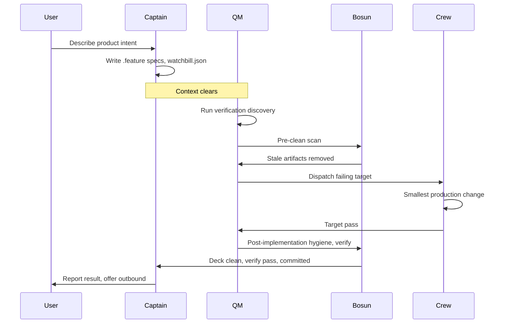
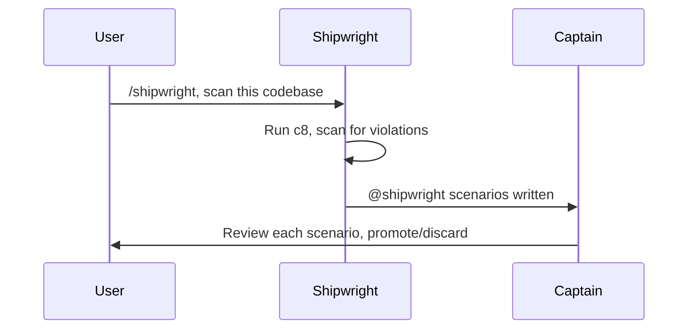

# Shipshape

[](https://skills.sh/dmytri/shipshape)

Shipshape is a portable skill set for coding agents.

It turns product intent into durable Cucumber specs, derives work from failing verification, and isolates agent roles so context does not leak into implementation.

**Specifications are durable. Code is disposable. Agents are replaceable.**

## Install

```bash
npx skills add dmytri/shipshape --skill '*'
```

This installs all five skills: `/shipshape`, `/captain`, `/qm`, `/crew`, and `/bosun`.

## Quickstart

1. Install all Shipshape skills:

   ```bash
   npx skills add dmytri/shipshape --skill '*'
   ```

2. Start with Captain:

   ```text
   /captain
   ```

   **Existing codebase?** Run `/shipwright` first. Shipwright reads production code and writes `@shipwright`-tagged scenario skeletons. Captain reviews these with you before the normal spec-driven loop begins.

3. Tell Captain the product behaviour you want.

4. Captain writes or updates `.feature` specs and, when useful, `watchbill.json`.

5. Clear the agent context, or use a runtime that clears context automatically.

6. Start Quartermaster:

   ```text
   /qm
   ```

7. QM derives verification from durable repository artifacts and dispatches Crew against failing targets.

8. Bosun performs hygiene, verification recheck, and local commit custody.

9. Captain reports back and handles decisions such as push, PR, publish, release, or deploy.

## Why Shipshape exists

Plain agent coding often traps product intent in chat. Memory-bank workflows can preserve too much stale context. Markdown-heavy spec-driven workflows can turn generated plans and task lists into false progress. Agents drift when the same context contains discovery, planning, tests, and code. Old specs, stale tests, and orphaned code pollute future work.

Shipshape answers those failure modes with a small, current-state workflow:

- Product behaviour lives in `.feature` specs.
- Work comes from undefined, unimplemented, or failing verification.
- Roles have strict custody over specs, verification, implementation, and hygiene.
- Context is cleared between Captain and Quartermaster.
- Bosun removes stale artifacts.
- `watchbill.json` selects and orders discovered work only; it does not create work.

## What Shipshape is

Shipshape is a disciplined workflow for keeping product intent durable, agent context disposable, and progress tied to verification.

It uses Cucumber-native specifications as the durable product contract. It treats production code and verification as rebuildable from that contract. Disposable does not mean careless; it means code and tests must justify their existence against current executable behaviour. Shipshape separates human-facing discovery, verification design, implementation, and cleanup into roles with narrow write scopes.

Shipshape is deliberately narrow. It is most opinionated about Cucumber-native executable specs, context-isolated roles, and verification-discovered work.

## What Shipshape is not

Shipshape is not:

- an IDE,
- a memory bank,
- a backlog format,
- a task-list generator,
- a project constitution,
- a code generator,
- a replacement for Cucumber,
- a runtime enforcement system by itself.

Shipshape is the portable skill layer. Enforcing runtimes can make the rules mechanical.

## What is authoritative?

Shipshape keeps the authoritative surface small:

- `.feature` files define binding product behaviour.
- `assets/**` are Captain-owned editable artifacts: product material, examples, fixtures, content, media, or other support material. Product-facing content should live in assets or project-approved content catalogs, such as Fluent, gettext, ICU MessageFormat, JSON/YAML catalogs, CMS exports, or framework-native i18n files. Assets and catalogs are not instructions, backlog, rationale, project memory, or hidden requirements.
- `AGENTS.md` or equivalent tooling config defines project tooling and agent configuration.
- `CAPTAIN.md`, if present, contains Captain-only non-binding notes.
- `watchbill.json` selects and orders verification-discovered work only.
- Trace comments explain why code or support artifacts exist; they do not define product intent.
- Git history preserves history. Current files describe current design.

If asset or catalog content must be protected as behaviour, specify that behaviour in a `.feature` scenario.

## Workflow and roles



Shipshape separates agent work by custody and context. Each role sees only the context needed for its job and writes only its own layer.

| Role | Owns | Does not own |
|---|---|---|
| Captain | Human-facing discovery, `.feature` specs, assets, `CAPTAIN.md`, optional `watchbill.json` | Production code, verification, hidden implementation instructions |
| Quartermaster | Verification design, tests, fixtures, step definitions, harness support | Product intent, production code, Captain notes |
| Crew | The smallest production-code change for one failing verification target | Specs, tests, broad refactors, product interpretation |
| Bosun | Hygiene, stale artifact removal, verification recheck, local commit custody | New behaviour, product decisions, push, PR, publish, release, deploy |

Only Captain talks to the user. QM, Crew, and Bosun are internal roles. They report through verification output, repository changes, and role hand-offs.

The most important boundary is Captain → QM. Captain may use human conversation to discover intent, but QM starts from clean context and reads only durable repository artifacts. This prevents discovery chat, rationale, and abandoned ideas from leaking into tests or implementation.

Role flow:

1. Captain captures product behaviour in current `.feature` specs.
2. Context clears.
3. QM derives executable verification from the specs.
4. Bosun may pre-clean stale artifacts before they shape verification or implementation.
5. Crew makes one focused production change for one failing target.
6. QM reruns verification and may dispatch more Crew work.
7. Bosun removes stale artifacts, checks hygiene, verifies, and commits locally.
8. Captain reports back to the user and handles decisions such as push, PR, publish, release, or deploy.

## What a session looks like

A user asks Captain:

```text
Let customers pay with a saved card at checkout.
```

Captain captures the behaviour as a durable scenario:

```gherkin
Feature: Saved card checkout

  Scenario: Customer pays with a saved card
    Given a customer has a saved card
    And the checkout total is "$42.00"
    When the customer pays with the saved card
    Then the payment is authorized
    And the order is confirmed
```

Captain may focus the next verification pass with `watchbill.json`:

```json
{
  "watch1": {
    "scenarios": [
      "features/checkout/saved-card-checkout.feature:Customer pays with a saved card"
    ]
  }
}
```

After context clears, QM reads only durable repository artifacts and runs focused verification. Exact commands depend on the adopting project's `AGENTS.md` tooling configuration.

```text
$ npm run test:bdd -- "features/checkout/saved-card-checkout.feature:Customer pays with a saved card"

Undefined step:
  When the customer pays with the saved card
```

QM adds or updates executable verification. If production behaviour fails, QM dispatches Crew with one target:

```text
Target:
features/checkout/saved-card-checkout.feature:Customer pays with a saved card

Failure:
Expected payment status "authorized", received "requires_payment_method".
```

Crew makes the smallest production-code change:

```diff
+ // Shipshape implements: features/checkout/saved-card-checkout.feature:Customer pays with a saved card
  async function payWithSavedCard(checkout, savedCard) {
-   return payments.createIntent({ amount: checkout.total });
+   return payments.createIntent({
+     amount: checkout.total,
+     paymentMethodId: savedCard.paymentMethodId,
+     confirm: true
+   });
  }
```

QM reruns the focused check:

```text
1 scenario passed
5 steps passed
```

Bosun removes stale artifacts, reruns configured verification, commits locally, and returns to Captain. Captain reports the result and asks whether to push, open a PR, publish, release, or deploy.

## Verification is progress

In Shipshape, progress is not a checked box in markdown. Progress is fewer undefined, unimplemented, or failing verification targets.

Verification works best when production code exposes narrow behaviour seams. Shipshape discourages hidden product behaviour in global state, constructors, static initialization, service locators, or broad side-effectful modules; it does not use seams to replace normal-path real coverage with mocks, fakes, or test-only branches.

- Verification discovers the worklist.
- `watchbill.json` can select and order discovered scenario work.
- Passing checks are evidence, not proof.
- QM should prefer Watchbill-selected and targeted focused runs over full tier runs when they are enough to advance the current target.
- Full tier runs are boundary checks, not the default inner loop.
- When no discovered work remains, Captain must offer to run the entire test suite across all tiers.
- Reports must distinguish fresh results from cache-backed results.

## Watchbill

`watchbill.json` lets Captain focus QM and Crew on a selected order of verification-discoverable scenarios. It does not create work; verification still decides what is undefined, unimplemented, failing, or passing.

Example:

```json
{
  "watch1": {
    "scenarios": [
      "features/checkout/card-payment.feature:Card payment is authorized"
    ]
  },
  "watch2": {
    "scenarios": [
      "features/checkout/refund.feature:Refund returns captured funds"
    ]
  }
}
```

Rules:

- Top-level keys are ordered watch groups such as `watch1`, `watch2`, and `watch3`.
- Each watch contains only `scenarios`.
- Each scenario reference uses `<spec>.feature:<Scenario Name>`.
- QM processes watches in order unless verification, product intent, environment, or tooling blocks.
- If Watchbill and verification disagree, verification wins.

## Harbour mode

When adding Shipshape to an existing codebase or between releases, run `/shipwright`. Shipwright works in-harbour — Crew is off deck. It scans production code with coverage tools and policy checks, then writes `@shipwright`-tagged scenario skeletons. Captain reviews each with the user before promoting to binding specs. QM ignores `@shipwright` until Captain promotes.



## Traceability

Shipshape uses lightweight trace comments when they make ownership, deletion, or behaviour mapping clearer:

```ts
// Shipshape implements: features/checkout/card-payment.feature:Card payment is authorized
// Step: Then the payment is authorized
```

- `implements` links production code to scenario behaviour.
- `supports` links helpers, fixtures, generated files, or assets to scenario behaviour.
- `verifies` is optional when a test-to-scenario mapping is not already clear.
- The canonical target is `<spec>.feature:<Scenario Name>`.
- Optional `Step:` detail is human-readable extra context.

Trace links explain why artifacts exist. They do not create work, replace verification discovery, or define product intent.

## Related approaches

Shipshape overlaps with spec-driven development tools, memory-bank workflows, and agent-team systems, but makes different tradeoffs.

| Approach | Common pattern | Shipshape difference |
|---|---|---|
| Spec-driven development tools | Requirements, plans, proposals, tasks, or implementation phases | Current Cucumber specs are the product contract; verification state discovers work. |
| Memory banks | Preserve context across sessions | Chat context is discarded; durable repository artifacts carry current intent. |
| Agent-team systems | Use roles, agents, or personas to organize work | Roles are custody boundaries, not an organization simulation. |
| Codegen-first systems | Generate or synchronize code from specs | Code and verification are disposable from specs, but implementation changes through failing verification targets. |

Shipshape combines four ideas: role custody, context isolation, verification as progress, and Cucumber-native traceability.

Related systems include [Kiro](https://kiro.dev), [Spec Kit](https://github.com/github/spec-kit), [OpenSpec](https://github.com/Fission-AI/OpenSpec), [Tessl](https://tessl.io), [BMAD Method](https://github.com/bmad-code-org/BMAD-METHOD), [Superpowers](https://github.com/obra/superpowers), [Paperclip](https://paperclip.ing), [Fusion](https://runfusion.ai), companies.sh, [Gastown](https://github.com/gastownhall/gastown), and similar systems.

For background, see Birgitta Böckeler's article on SDD tools on Martin Fowler's site: [Exploring Gen AI: Spec-Driven Development Tools](https://martinfowler.com/articles/exploring-gen-ai/sdd-3-tools.html).

## Enforcement and portability

Shipshape skills work anywhere a coding agent can read repository files and follow role instructions. The workflow is portable by design: Cucumber specs, verification output, trace comments, and git history carry the durable state.

Skill-only agents follow the rules by explicit discipline. Enforcing runtimes can turn the same rules into mechanical checks.

## Origin

Shipshape was extracted from work done at [Saleor](https://saleor.io), an open-source, headless GraphQL e-commerce platform.

For an agent-oriented way to start Saleor storefront work, see [Jolly](https://jolly.cool). Jolly is experimental and should be treated as a preview.

## License

BSD Zero Clause License
