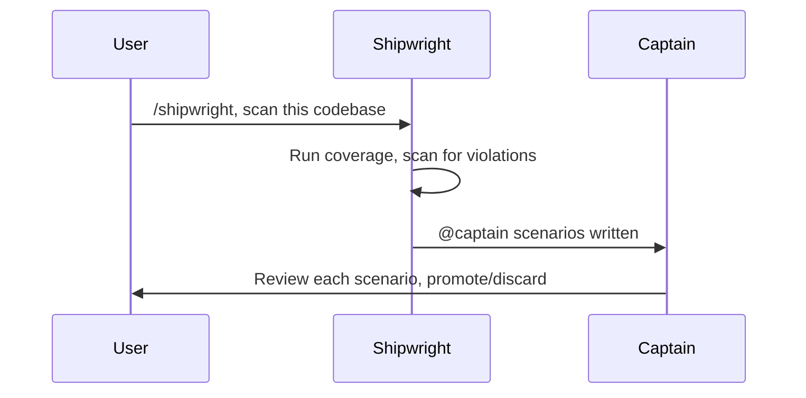

# Shipshape

[](https://skills.sh/dmytri/shipshape)

Shipshape is a portable skill set for coding agents. It turns product intent into durable Cucumber specs, derives work from failing verification, and isolates agent roles so discovery context does not leak into implementation.

**Specifications are durable. Code is disposable. Agents are replaceable.**

The Ship of Theseus is a classical thought experiment recorded by Plutarch. The Athenians preserved the hero's ship by repair: rotten timber out, new timber in, until none of the original planks remained. Was it still the same ship?

AI agents make the old question urgent. An agent can rewrite code, tests, fixtures, and support files in an afternoon, and every pass replaces more planks. A codebase maintained this way needs a durable source of identity, something that survives its own repair.

Shipshape's answer is that the ship was never its planks. Identity lives in the specification. Durable specs, traceable Planks, and verified behaviour preserve what matters while everything else remains free to change.

## Install

```bash
npx skills add dmytri/shipshape --skill '*'
```

This installs all six skills: `/shipshape`, `/captain`, `/qm`, `/crew`, `/boatswain`, and `/shipwright`.

Agents with plugin support can install Shipshape as a plugin instead:

```bash
npx plugins add dmytri/shipshape
```

The plugin carries the same six skills and adds mechanical enforcement. Plugin installs invoke skills under the plugin namespace, for example `/shipshape:captain`. See [Enforcement and portability](#enforcement-and-portability).

## Quickstart

1. Start with Captain:

   ```text
   /captain
   ```

   **Existing codebase?** Run `/shipwright` first. It is thorough and slow, but required: every production seam is planked, every uncovered behaviour inventoried. Captain reviews the results with you before the normal spec-driven loop begins.

2. Tell Captain the product behaviour you want.

3. Captain writes or updates `.feature` specs and, when useful, `watchbill.json`.

4. Clear the agent context, or use a runtime that clears context automatically.

5. Start Quartermaster:

   ```text
   /qm
   ```

6. QM derives verification from durable repository artifacts and dispatches Crew against failing targets.

7. Boatswain performs hygiene, verification recheck, and local commit custody.

8. Captain reports back and handles decisions such as push, PR, publish, release, or deploy.

## How it works


Shipshape separates agent work by custody and context. Each role sees only the context needed for its job and writes only its own layer.

| Role | Owns | Does not own |
|---|---|---|
| Captain | Human-facing discovery, `.feature` specs, assets, `CAPTAIN.md`, optional `watchbill.json` | Production code, verification, hidden implementation instructions |
| Quartermaster | Verification design, tests, fixtures, step definitions, harness support | Product intent, production code, Captain notes |
| Crew | The smallest production-code change for one failing verification target | Specs, tests, broad refactors, product interpretation |
| Boatswain | Hygiene, stale artifact flagging, non-code cleanup, verification recheck, local commit custody | New behaviour, product decisions, push, PR, publish, release, deploy |
| Shipwright | In-harbour code inspection, `@captain` candidate scenarios, `@planks(...)` annotations, safe removal of `@shipwright`-flagged code | Product intent, production-code behaviour changes |

Only Captain talks to the user. QM, Crew, Boatswain, and Shipwright are internal roles. They report through verification output, repository changes, and role hand-offs.

The most important boundary is Captain to QM. Captain may use human conversation to discover intent. QM starts from clean context and reads only durable repository artifacts. Discovery chat, rationale, and abandoned ideas never reach tests or implementation.

Progress is not a checked box in markdown. Progress is fewer undefined, unimplemented, or failing verification targets. Verification discovers the worklist. Passing checks are evidence, not proof. QM prefers focused runs over full tier runs. Full tier runs are boundary checks, not the default inner loop. Reports distinguish fresh results from cache-backed results. When no discovered work remains, Captain offers to run the entire test suite across all tiers.

Verification works best when production code exposes narrow behaviour seams. Shipshape discourages hidden product behaviour in global state, constructors, static initialization, and service locators. Seams serve real verification. They never replace normal-path real coverage with mocks, fakes, or test-only branches.

## What a session looks like

A user asks Captain:

```text
Let customers pay with a saved card at checkout.
```

Captain captures the behaviour as a durable scenario:

```gherkin
Feature: Saved card checkout

  Scenario: Customer pays with a saved card
    Given a customer has a saved card
    And the checkout total is "$42.00"
    When the customer pays with the saved card
    Then the payment is authorized
    And the order is confirmed
```

Captain may focus the next verification pass with `watchbill.json`:

```json
{
  "watch1": {
    "scenarios": [
      "features/checkout/saved-card-checkout.feature:Customer pays with a saved card"
    ]
  }
}
```

After context clears, QM reads only durable repository artifacts and runs focused verification. Exact commands come from the adopting project's `RIGGING.md`.

```text
$ npm run test:bdd -- "features/checkout/saved-card-checkout.feature:Customer pays with a saved card"

Undefined step:
  When the customer pays with the saved card
```

QM adds or updates executable verification. If production behaviour fails, QM dispatches Crew with one target:

```text
Target:
features/checkout/saved-card-checkout.feature:Customer pays with a saved card

Failure:
Expected payment status "authorized", received "requires_payment_method".
```

Crew makes the smallest production-code change:

```diff
+ /**
+  * @planks("When the customer pays with the saved card")
+  */
  async function payWithSavedCard(checkout, savedCard) {
-   return payments.createIntent({ amount: checkout.total });
+   return payments.createIntent({
+     amount: checkout.total,
+     paymentMethodId: savedCard.paymentMethodId,
+     confirm: true
+   });
  }
```

QM reruns the focused check:

```text
1 scenario passed
5 steps passed
```

Boatswain flags stale artifacts, cleans non-code cruft, reruns configured verification, commits locally, and returns to Captain. Captain reports the result and asks whether to push, open a PR, publish, release, or deploy.

## Watchbill

`watchbill.json` lets Captain focus QM and Crew on a selected order of verification-discoverable scenarios. It does not create work. Verification still decides what is undefined, unimplemented, failing, or passing.

Example:

```json
{
  "watch1": {
    "scenarios": [
      "features/checkout/card-payment.feature:Card payment is authorized"
    ]
  },
  "watch2": {
    "scenarios": [
      "features/checkout/refund.feature:Refund returns captured funds"
    ]
  }
}
```

Rules:

- Top-level keys are ordered watch groups such as `watch1`, `watch2`, and `watch3`.
- Each watch contains only `scenarios`.
- Each scenario reference uses `<spec>.feature:<Scenario Name>`.
- QM processes watches in order unless verification, product intent, environment, or tooling blocks.
- If Watchbill and verification disagree, verification wins.

## Traceability

Feature files are canon. Shipshape derives the map from current feature files, through scenarios and steps, into step definitions and production seams.

A seam is a stable production boundary where behaviour can be entered, observed, or owned. Shipshape uses seams for real verification and Planks traceability, not for mocks, fakes, test-only branches, or harness-only code. Trace annotations are hoisted to seams because Planks may be distributed below that boundary.

Planks are the behaviour-bearing production code required by Gherkin step contracts. Shipshape coins the term. An individual plank may be as small as an argument, expression, branch, call, state change, or persisted value. Shipshape does not trace individual planks. It traces plank sets by annotating the smallest stable production seam that owns the behaviour.

```ts
/**
 * @planks("When the customer pays with the saved card")
 * @planks("Then the payment is authorized")
 */
export async function payWithSavedCard(checkout, savedCard) {
  // production behaviour
}
```

| Concept | Layer | Purpose | Example |
|---|---|---|---|
| Step | Spec | Durable product contract | `When the customer pays with the saved card` |
| Seam | Production | Stable behaviour surface | `export async function payWithSavedCard()` |
| Plank | Trace | Links seam to step | `@planks("When the customer pays with the saved card")` |

- `@planks("<Gherkin step>")` marks a production seam whose behaviour is required by that exact step.
- Include the Gherkin keyword. Normalize `And` and `But` to the inherited `Given`, `When`, or `Then`.
- Not every step requires Planks. Every production seam does.
- A seam may carry Planks for several steps. One step may be carried by several seams.
- A seam must not contain behaviour outside its related step contracts. Extra behaviour is missing specification, misplaced code, or dead code.
- Do not trace production code to features or scenarios. Scenario coverage is derived through Cucumber's scenario-to-step mapping.

Trace annotations explain why production seams exist. They do not create work, replace verification discovery, or define product intent.

## Perturbation

Scenarios pin behaviour. Durable context also carries requirements that leave behaviour unchanged: a `Rule:` in a feature, a coding standard in `AGENTS.md`, a dependency or tooling value in `RIGGING.md`. When such a requirement changes, a seam can pass every step and still fall out of compliance.

A perturbation marks that seam for reimplementation. Captain adds the `fail-fast` statement from `RIGGING.md` at the seam, and the seam becomes a failing verification target. QM discovers the failure and dispatches it like any other. Crew reimplements the seam from current durable context and removes the perturbation statement with the reimplemented seam. The scenarios passing again prove the behaviour survived the rebuild. Boatswain verifies each removed perturbation before commit.

## Harbour mode

When adding Shipshape to an existing codebase or between releases, run `/shipwright`. Shipwright works in-harbour, Crew is off deck. It scans production code with coverage tools and policy checks, then writes `@captain`-tagged scenario skeletons and `@planks(...)` annotations. Captain reviews each with the user: promote to a binding spec by removing the tag, or discard by retagging to `@shipwright`. The next harbour removes the code a `@shipwright` scenario traces to, then deletes the scenario. QM ignores `@captain` and `@shipwright` scenarios.

On an existing codebase, this is a long and painful process. Every production seam is planked, every uncovered behaviour inventoried, every policy violation flagged. There is no shortcut. But when it finishes, the codebase is traced to feature-file steps and ready for spec-driven development. The pain is the point: it surfaces how much of the codebase was undocumented, untested, or accidental.



## Design position

Plain agent coding often traps product intent in chat. Memory-bank workflows preserve too much stale context. Markdown-heavy spec-driven workflows turn generated plans and task lists into false progress. Agents drift when the same context contains discovery, planning, tests, and code. Old specs, stale tests, and orphaned code pollute future work.

Shipshape answers those failure modes with a small, current-state workflow:

- Product behaviour lives in `.feature` specs.
- Work comes from undefined, unimplemented, or failing verification.
- Roles have strict custody over specs, verification, implementation, and hygiene.
- Context is cleared between Captain and Quartermaster.
- Boatswain flags stale production artifacts and cleans non-code cruft.
- `watchbill.json` selects and orders discovered work only. It does not create work.

Disposable does not mean careless. Code and tests must justify their existence against current executable behaviour. Humans edit code at any time. Shipshape has no backlog, no task list, and no agent memory of planned work. Agents derive the next action from current verification state. If you fix a bug by hand, QM sees it pass and moves on. If you break something, QM flags it. There is no stale plan to reconcile.

The authoritative surface stays small:

- `.feature` files define binding product behaviour.
- `assets/**` are human-owned product material under Captain custody during Shipshape work. Product-facing content should live in assets or project-approved content catalogs. Assets and catalogs are not instructions, backlog, rationale, project memory, or hidden requirements.
- `AGENTS.md` is the human-facing agent entry document.
- `RIGGING.md` holds project tooling values such as stack, directories, commands, and the perturbation statement.
- `CAPTAIN.md`, if present, contains Captain-only non-binding notes.
- `watchbill.json` selects and orders verification-discovered work only.
- `@planks(...)` annotations explain why production seams exist. They do not define product intent.
- Git history preserves history. Current files describe current design.

If asset or catalog content must be protected as behaviour, specify that behaviour in a `.feature` scenario.

Shipshape is not an IDE, a memory bank, a backlog format, a task-list generator, a project constitution, a code generator, or a replacement for Cucumber.

## Enforcement and portability

Shipshape skills work anywhere a coding agent can read repository files and follow role instructions. The workflow is portable by design: Cucumber specs, verification output, `@planks(...)` annotations, and git history carry the durable state.

Skill-only agents follow the rules by explicit discipline. Enforcing runtimes turn the same rules into mechanical checks. This repository ships an optional plugin layer in the vendor-neutral open-plugin format that mechanizes two disciplines on supporting runtimes:

- **Context isolation.** Role agents run QM, Crew, Boatswain, and Shipwright in isolated context windows. The Captain to QM firewall becomes mechanical.
- **Custody.** Hooks block writes outside each role's write scope, hold local commits to Boatswain, keep outbound actions Captain-only, and refuse `/qm` when Captain context is visible.
- **Derived status.** The `/shipshape:status` command reports deck state from repository signals: tree cleanliness, commits ahead of upstream, `@captain` and `@shipwright` counts, perturbations, and watchbill validity.
- **Install audit.** The `/shipshape:doctor` command audits the installation itself: completeness of each installed copy, freshness against upstream, and coherence across channels and scopes, so stale or shadowed doctrine is found instead of trusted.

The skills remain canonical and sufficient on their own. Every plugin artifact cites the skill text it enforces and adds no doctrine. Removing the plugin loses nothing but enforcement. Enforcement strength depends on each runtime's hook and subagent support. Skills are the floor everywhere. The plugin layer is exercised on Claude Code today; other plugin targets receive the same artifacts and degrade to whatever hooks and subagents they support.

## Related approaches

Shipshape overlaps with spec-driven development tools, memory-bank workflows, and agent-team systems, but makes different tradeoffs.

| Approach | Common pattern | Shipshape difference |
|---|---|---|
| Spec-driven development tools | Requirements, plans, proposals, tasks, or implementation phases | Current Cucumber specs are the product contract; verification state discovers work. |
| Memory banks | Preserve context across sessions | Chat context is discarded; durable repository artifacts carry current intent. |
| Agent-team systems | Use roles, agents, or personas to organize work | Roles are custody boundaries, not an organization simulation. |
| Codegen-first systems | Generate or synchronize code from specs | Code and verification are disposable from specs, but implementation changes through failing verification targets. |

Shipshape combines four ideas: role custody, context isolation, verification as progress, and Cucumber-native traceability.

Related systems include [Kiro](https://kiro.dev), [Spec Kit](https://github.com/github/spec-kit), [OpenSpec](https://github.com/Fission-AI/OpenSpec), [Tessl](https://tessl.io), [BMAD Method](https://github.com/bmad-code-org/BMAD-METHOD), [Superpowers](https://github.com/obra/superpowers), [Paperclip](https://paperclip.ing), [Fusion](https://runfusion.ai), companies.sh, [Gastown](https://github.com/gastownhall/gastown), and similar systems.

For background, see Birgitta Bockeler's article on SDD tools on Martin Fowler's site: [Exploring Gen AI: Spec-Driven Development Tools](https://martinfowler.com/articles/exploring-gen-ai/sdd-3-tools.html).

## Maturity

Shipshape is pre-validation. It has a single author and no published case studies. Skill-only use relies on voluntary agent discipline. The plugin layer mechanizes custody and context isolation on supporting runtimes, and that enforcement is equally unproven. Shipshape inherits the no-version-pinning supply-chain properties of skills.sh. The ideas are internally consistent and the vocabulary is deliberate, but Shipshape has not yet been proven outside its origin.

## Origin

Shipshape was extracted from work done at [Saleor](https://saleor.io), an open-source, headless GraphQL e-commerce platform.

For an agent-oriented way to start Saleor storefront work, see [Jolly](https://jolly.cool). Jolly is experimental and should be treated as a preview.

## License

BSD Zero Clause License
