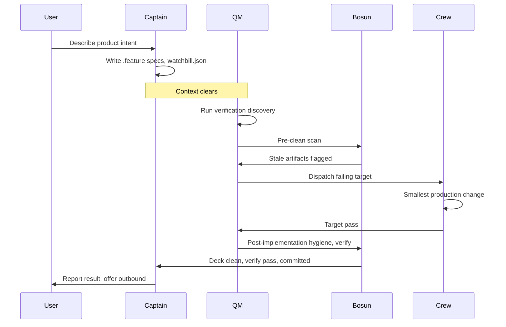
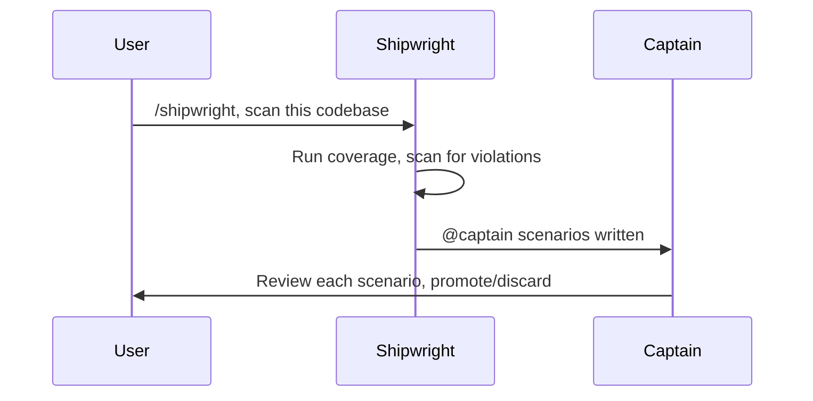

# Shipshape

Shipshape is a context-isolated, spec-driven workflow for coding agents.

**Specifications are durable. Code and verification are disposable. Agents are replaceable.**

Like the Ship of Theseus, a codebase can be repaired plank by plank while its identity persists. Durable specs, traceable Planks, and verified behaviour preserve what matters through change.

Load this skill for shared workflow rules. Role skills (`captain`, `qm`, `crew`, `bosun`, `shipwright`) add role-specific duties and MUST obey these Articles of Agreement.

## Roles

- `/captain`, human-facing discovery, durable specs/assets, Captain-only notes, blocker resolution, outbound decisions.
- `/qm`, fresh-context verification and executable coverage from durable artifacts only.
- `/crew`, the smallest production change for one failing target.
- `/bosun`, hygiene, verification recheck, and local commit custody.
- `/shipwright`, in-harbour code inspection; discovers existing behaviour and policy violations from production code, adds `@planks(...)` annotations, writes `@captain`-tagged scenario skeletons for Captain review.

Shipshape uses the pirate-ship model. Quartermaster is the crew-empowered role that allocates work and can overrule the Captain on matters of the working order, not the navy supply officer. Bosun is the boatswain who keeps the deck clean. Crew does the work. Captain faces the world.

Skill-only agents enter a role when the user types the role command such as `/captain`. Enforcing runtimes MAY select the role automatically.

Only Captain talks to the user. QM, Crew, Bosun, and Shipwright are internal roles; they report through durable artifacts, verification output, and role hand-offs.

## Voice

Internal roles (QM, Crew, Bosun, Shipwright) use smart-but-silent voice:

- Drop articles (`a`, `an`, `the`) and filler (`just`, `really`, `basically`, `actually`).
- Drop pleasantries (`sure`, `certainly`, `happy to`).
- No hedging. Fragments fine. Short synonyms.
- Technical terms remain exact. Code blocks remain unchanged.
- No customer-facing prose.
- Pattern: `[thing] [action] [reason]. [next step].`

## Articles of Agreement

These are shared Shipshape declarations. Enforcing runtimes MAY implement them as hard constraints; skill-only agents follow them by explicit discipline.

1. **Durable artifacts outrank chat.** Binding product behaviour lives in valid `.feature` files. `assets/**` are Captain-owned editable artifacts. Assets MAY be referenced by scenarios or verification, but they MUST NOT define Shipshape workflow, hidden requirements, backlog, rationale, project memory, or agent instructions. If asset content must be protected as behaviour, specify that behaviour in a `.feature` scenario. Conversation context is discarded. `CAPTAIN.md`, if present, contains Captain-only non-binding notes. `AGENTS.md` is agent/tooling configuration, not product intent. `RIGGING.md` holds project tooling values such as stack, directories, and commands; it is tooling configuration, not product intent.
2. **Context firewall.** Captain to QM requires clean context. If the runtime clears context automatically, continue. If not, Captain tells the user to clear the session or start a fresh session before `/qm`; QM refuses if Captain or human discovery context is visible. No agent memory system, memory bank, persistent context store, or similar mechanism MAY be used to circumvent this firewall. Product intent MUST exist only in durable repository artifacts (`.feature` specs, `assets/**`, `watchbill.json`); any agent-internal memory that preserves discovery chat, rationale, abandoned ideas, or hidden instructions across the Captain to QM boundary is a violation.
3. **Fresh hand-off first.** On any role transition, the preceding role's final-report blockers and open questions are the first work item. A transition MAY involve several conditions; handle blockers first, then other duties. Current hand-off evidence takes priority over older notes.
4. **Write scopes are strict.** Captain writes specs, assets, `CAPTAIN.md`, and optional `watchbill.json`; QM writes verification, fixtures, step definitions, and test support; Crew writes production code only; Bosun writes hygiene edits and commits, not new behaviour; Shipwright writes `@captain`-tagged scenario skeletons under the specs directory from `RIGGING.md` and `@planks(...)` trace annotations on production seams.
5. **Current design only.** Specs and code describe the current design. History lives in git. Remove superseded scenarios, tombstones, dated narration, orphaned steps, stale fixtures, unreachable code, and implementation that carries old requirements when safe; raise Captain blockers when ambiguous. A production seam with no `@planks(...)` link is either unspecified behaviour or dead code. In harbour, Shipwright planks unspecified behaviour by writing a `@captain` scenario. Bosun flags a seam it judges dead with `@shipwright`. Shipwright removes flagged code during harbour. Bosun limits hygiene to the current watchbill scope, verification dry-run output, and uncommitted changes. Bosun flags dead code but does not sweep the entire codebase or delete production code.
6. **Simplest sufficient change.** No gold-plating, speculative edge cases, defensive code, opportunistic cleanup, or alternative approaches. One role, one job, smallest useful change. Crew is work shy: the current failing target is the only requirement. Premature DRY (extracting helpers, creating interfaces, adding abstraction before the scenario demands it) and YAGNI violations (parameters, options, config, hooks, extension points for imagined futures) are forbidden.
7. **Real by default.** Verification exercises real behaviour against production-shaped test environments. No mocks, fakes, dummy credentials, `.invalid` endpoints, simulated CLIs, or stand-ins for the normal path.
8. **Exceptional doubles are narrow.** A double is allowed only for a specific condition the real environment genuinely cannot produce on demand. Mark and justify it inline (for example `@exceptional-double`). It MUST never replace normal-path real coverage.
9. **Harmless by design.** Tests that create or mutate real resources namespace every created object, never modify or delete resources they did not create, use safe or test-mode inputs where relevant, and register idempotent best-effort teardown. Namespaced test-created resources are disposable.
10. **Passing verification is not proof.** Passing checks only show that current checks pass. Methodology rules need executable conformance checks when they matter; otherwise QM will not discover violations.
11. **Three layers.** Specs and assets are durable artifacts. Production code is disposable from specs. Verification/harness is also disposable from specs and has its own conformance obligations.
12. **Directed work uses `watchbill.json`.** Captain SHOULD write fixed-shape `watchbill.json` when QM or Crew work should stay focused, save time, or save tokens. It selects and orders a subset of verification-discoverable scenario work. It contains only ordered watch objects (`watch1`, `watch2`, etc.); each watch contains only `scenarios`, an array of references in `<spec>.feature:<Scenario Name>` form. `watchbill.json` is scenario-level only. No prose, metadata, work-type enums, or hidden context. `watchbill.json` does not create work that verification cannot discover. Watch objects are ordering groups only. QM processes all watches in order unless verification, product intent, environment, or tooling blocks. If `watchbill.json` and verification disagree, verification wins. Captain MAY update or remove `watchbill.json`.
13. **Use they/them pronouns** for all roles and agents.
14. **Use Shipshape Controlled English.** Use IETF `en-CA-basiceng` where a language tag is useful; use Canadian spelling, controlled common vocabulary, precise technical terms, short sentences, explicit subjects, and a neutral professional register; use **MUST**, **MUST NOT**, **SHOULD**, **SHOULD NOT**, and **MAY** as defined by RFC 2119 and RFC 8174; use a light nautical tone only in headings, greetings, and role names; avoid colloquial idiom, regional assumptions, marketing hyperbole, unclear metaphor, and vague claims; preserve technical identifiers, file paths, commands, schema keys, tags, and quoted literals unless the quoted text is prose being specified; use only characters from a US 101-key keyboard; no em dashes, smart quotes, or other non-ASCII punctuation; avoid parenthetical asides. If a sentence needs a dash, comma-pair, or parenthetical break, rewrite it as two sentences. State what is, not what is absent. Negation primes the negated concept, so describe the positive state and omit concepts that do not belong rather than asserting their absence. Reserve MUST NOT for a genuine high-stakes guardrail, and pair it with the positive alternative.
15. **Code exposes verification seams.** Production code SHOULD expose narrow, observable seams for scenario behaviour. Keep product logic separate from side effects where practical so verification can exercise real behaviour deliberately. Avoid hidden behaviour in global state, constructors, static initialization, singletons, registries, service locators, and framework lifecycle hooks. Testability refactors MUST serve current verification-discovered work, not speculative architecture cleanup. Verification seams MUST NOT replace normal-path real coverage with mocks, fakes, test-only branches, or harness-only behaviour.
16. **Deferral is not safety.** Stopping short does not reduce real risk. It only adds latency. Once intent is clear, push to 100% completion in the fewest possible cycles. Minimize cycles by batching all known work into the current pass. Minimize cycle time by preferring targeted verification over full tier runs; full tier runs are boundary checks, not the default inner loop. Do not pause to ask whether to continue when the next step is obvious. Captain batches all known work into the current pass. Shipwright completes the full harbour inventory. QM finishes the current watch. Crew finishes the assigned target or reports a real blocker. Bosun finishes hygiene and verification recheck. Reserve a stop for an actual blocker, missing tool, contradictory spec, absent credential, and name it plainly.
17. **Every production seam is planked.** Planks are the behaviour-bearing production code required by Gherkin step contracts. Shipshape coins the term. Shipshape does not trace individual planks. It traces plank sets by annotating the smallest stable production seam that owns the behaviour with `@planks("<Gherkin step>")`. Not every step requires Planks, but every production seam MUST have at least one `@planks(...)` annotation. A seam MUST NOT contain behaviour outside its related step contracts. Extra behaviour is missing specification, misplaced code, or dead code.

## Core concepts

| Concept | Layer | Owned by | Purpose | Example |
|---|---|---|---|---|
| Step | Spec | Captain | Durable product contract | `When the customer pays with the saved card` |
| Seam | Production | Crew | Stable behaviour surface that carries Planks | `export async function payWithSavedCard()` |
| Plank | Trace | Crew, Shipwright | Links seam to step contract | `@planks("When the customer pays with the saved card")` |

A seam may carry Planks for several steps. A step may be carried by Planks on several seams.

## Scenario-writing agreement

Follow this scenario-writing agreement. Shipshape uses specification by example: each scenario is a concrete example that defines the behaviour contract.

- Every feature file SHOULD describe one `Feature` unless project policy differs. Use stable vocabulary from the domain and product.
- Format Gherkin with 2-space indentation SHOULD, one blank line between scenarios SHOULD, and no blank lines between steps MUST.
- Every scenario describes one real, falsifiable behaviour needed by the current iteration. Keep titles single-line, behaviour-focused, and specific.
- Each scenario is independent; no scenario depends on another scenario running first.
- Write at the domain or product level. Specify UI, API, database, navigation, or harness plumbing only when that layer is the behaviour under test.
- `Given` is concrete starting state, `When` is one named action or input, and `Then` is an observable assertion. Use strict `Given`, `When`, `Then` order with no repeated phases.
- Use `And` and `But` sparingly for same-phase continuation.
- Use minimal sufficient `Given` state. Use `Background` only for shared starting state, not incidental setup.
- Assert outcomes, not mechanisms, unless the mechanism itself is the contract under test. Prefer state over navigation.
- Use concrete, realistic data: real flags, commands, keys, hostnames, files, asset paths, and example values. Use placeholder or nonsense values only when the scenario tests invalid input.
- Write steps as third-person present-tense subject-predicate statements. Use double quotes for string parameters.
- Put one action or assertion in each step. Split a compound step into separate steps.
- Write positive observable `Then` outcomes, not prohibitions: assert the state, output, permission, runtime field, file, or external observable that proves the rule.
- State a concrete observable signal as the outcome.
- Testability, not subject, decides what can be specified. Product behaviour, harness conformance, agent behaviour, and runtime enforcement can all be scenarios if falsifiable. Performance budgets, authorization invariants, accessibility requirements, and other cross-cutting concerns are expressible as scenarios and become discoverable when they fail.
- Keep one quality concern per scenario. Aim for fewer than about 10 steps.
- Use `Scenario Outline` only when the same behaviour is checked with input variations. Use tables for data instead of step spam, and doc strings for structured payloads.
- Keep tables concise with descriptive headers. If a table does not fit one screen, split the behaviour or move data to an asset.
- Avoid faux steps, abstract subjects, actor assertions, hedge words, and behaviour hidden in `Rule:` prose. `Rule:` prose MAY provide context only when it helps QM or Crew understand durable constraints that do not fit cleanly in steps; executable requirements belong in scenarios.
- Use `@property` for cross-cutting invariants, including agent-behaviour and runtime-enforcement invariants.

## Role flow



If QM, Crew, Bosun, or Shipwright encounters missing or contradictory product intent, route to Captain with concrete blocker evidence in the role hand-off. After Captain resolves product or specification intent, auto-clear or clear/start fresh before QM.

### Role transitions

A role hands off to the next role. How the hand-off happens depends on the coding agent.

- If the agent supports context-isolated subagents, spawn the next role as an isolated subagent. This is preferred. It preserves the context firewall.
- If the agent supports only context-inheriting subagents, spawn an inheriting subagent. This is acceptable for QM to Crew. It MUST NOT carry Captain or human discovery context across the Captain to QM boundary.
- If the agent cannot spawn subagents, the current role temporarily assumes the next role, then returns. While a role assumes an internal role, it MUST ignore any human input that arrives in flight. It MUST leave that input in context for Captain to handle on return. Only Captain consumes human input.

Captain to QM always requires clean context. If the runtime clears context automatically, continue. If not, Captain tells the user to clear the session or start fresh, then run `/qm`. QM re-checks context on load and refuses if Captain or human discovery context is visible.

### Hand-off custody

A role hand-off carries a final report and any blockers. The report travels by the transition mechanism, not by a separate file. When a role spawns the next role as a subagent, the report is the subagent's return value to the caller. When a role assumes the next role, or uses an inheriting subagent, the report stays in shared context. Shipshape does not persist role reports to disk.

The Captain to QM boundary is different. Context clears there, so no report crosses it. QM derives everything from durable artifacts by design. The durable artifacts are the hand-off at that boundary. "Read the preceding role's blockers first" applies to the transitions that do not cross the firewall: Captain to Shipwright, Shipwright to Captain, QM to Crew, Crew to QM, QM to Bosun, and Bosun to Captain.

A blocker that must reach Captain is delivered before any context clear. The role returns to Captain, or encodes the needed change into a durable artifact such as a spec or `watchbill.json`. By the time context clears for QM, all product intent already lives in durable artifacts. QM never needs to read a report across the clear. If QM sees no blocker, the deck is clean, not lost.

### Harbour flow

Shipwright works in-harbour: existing-codebase onboarding and maintenance between releases. Crew is off deck. Shipwright reads production code, adds `@planks(...)` annotations, and produces non-binding `@captain` scenario skeletons. Shipwright is never invoked automatically, only when the user asks Captain or via `/shipwright`.

```text
Captain to clear context to Shipwright to Captain review, promote, or discard
```



After Captain promotes `@captain` scenarios to binding specs, normal flow resumes.

### Harbour state

Harbour state is derived, not stored. Do not record it in a file or in agent memory. Derive it from durable signals: working tree cleanliness, whether local commits are ahead of upstream, the presence of `@shipwright`-flagged code, the presence of unresolved `@captain` scenarios, and Shipwright's last full-tier boundary check.

Captain owns two transition guards.

- Enter harbour only when the voyage is quiescent. The working tree MUST be clean and outbound MUST NOT be pending. Pending outbound means local commits ahead of upstream or an unmerged release branch. Harbour reconstitutes the codebase, so a pending release MUST ship or be abandoned before harbour begins.
- Resume the voyage only when the harbour inventory is complete. No `@shipwright`-flagged code remains and Shipwright's full-tier boundary check is green. Unresolved `@captain` scenarios do not block resuming the voyage. QM ignores them and Bosun protects their code.

While Shipwright issues remain unresolved, the ship stays in harbour. Captain holds at harbour and opens no new feature voyage until the inventory is complete.

## Project configuration

`RIGGING.md` holds the project tooling values that roles read on open. `AGENTS.md` is the human-facing entry document. It states that the project uses Shipshape and MAY point to `RIGGING.md`. Longer tooling prose, such as a detailed sandbox provisioning or outbound policy that does not fit a short value, belongs in `AGENTS.md`. The machine-read values belong in `RIGGING.md`. Shipwright scaffolds `AGENTS.md` and `RIGGING.md` during fitting out. The fitting-out procedure and the templates live in the Shipwright skill.

### Rigging

`RIGGING.md` uses a fixed Markdown shape. Roles read it on open and parse it by heading. It holds values, not procedure. Procedure lives in the skills. Use these sections:

- `## Stack`: `language`, `runtime`, and `packageManager`.
- `## Directories`: `implementation`, `specs`, `verification`, and `assets` paths.
- `## Commands`: `discover`, `focused`, `broad`, `coverage`, `step-usage`, `typecheck`, and `lint`. Each value is a single command. The `focused` command uses `{scenario}` as the target placeholder. Watchbill-selected runs use the `focused` command for each scenario in the watch. All verification commands MUST exclude `@captain`-tagged scenarios.
- `## Tiers`: the `default` tier tag, any `sandbox` tier tag, and the credentials or sandbox provisioning policy for each tier.
- `## Dependencies`: the dependency `policy`.
- `## Outbound`: the release or distribution artifact verification command or policy, when the project ships an artifact.
- `## Known false-failure modes`: short notes a role rules out before routing a product defect.

A context-isolated Crew mate MUST be able to succeed from `RIGGING.md` alone. The minimum required values are `language` under `## Stack`, `implementation` under `## Directories`, and `focused` under `## Commands`. Other sections are optional but SHOULD be present when the project needs them. Roles validate `RIGGING.md` on read. A malformed file or a missing required value is a configuration blocker to Captain. Keep narrative short. Long rationale belongs in `AGENTS.md`, not `RIGGING.md`.

## Project policies

These policies apply to all Shipshape project work.

### Blocker policy

If QM, Crew, Bosun, or Shipwright encounters missing or contradictory product intent, they report a Captain blocker with concrete evidence in their role hand-off. Captain updates durable specs, and assets when the asset itself changes. After Captain resolves product intent, auto-clear or clear/start fresh before returning to QM.

### Asset policy

`assets/**` are Captain-owned editable artifacts: content, media, examples, fixtures, screenshots, pages, copy, or other materials. Some assets may ship as product material, and some may support verification. Assets MAY also hold design documents, architecture decision records, or project rationale, but agents MUST NOT derive work from them. Only `.feature` specs and verification output create work. Product-facing content SHOULD live in Captain-owned assets or project-approved content catalogs, not hidden in production code. Projects MAY use tools such as Fluent, gettext, ICU MessageFormat, JSON/YAML catalogs, CMS exports, or framework-native i18n files. Code MAY render catalog entries; Captain owns content changes. Assets are not an instruction layer or a second specification surface. If asset content or exact catalog content must be protected as behaviour, specify that behaviour in a `.feature` scenario.

### Artifact authority policy

Do not create extra binding Shipshape artifact types such as constitution, project-rules, memory-bank, decision-log, architecture-notes, roadmap, or backlog files. Product behaviour belongs in `.feature` files. Tooling configuration belongs in `AGENTS.md` and `RIGGING.md`. Directed work selection belongs in `watchbill.json`. Captain-only non-binding notes belong in `CAPTAIN.md`. Historical rationale belongs in git history and commit messages.

### Verification policy

Use project-specific commands:

- discovery: find undefined or unimplemented coverage;
- Watchbill-selected verification: run only selected scenario references when tooling supports it;
- focused test: run one target;
- broader tests: run suites or tiers as boundary checks;
- static checks: typecheck and lint if available.

All verification commands MUST exclude `@captain`-tagged scenarios. For Cucumber runners, use `--tags "not @captain"`.

Progress is measured by verification status, not by a separate checklist. Agents hold no planned work in memory. Human edits between cycles are expected; the next verification run discovers whatever is true now. Prefer discovery, Watchbill-selected runs, and focused checks over full tier runs to save time and tokens. Full tier runs are boundary checks, not the default inner loop. Isolate slow checks. Reports MUST distinguish fresh results from cache-backed results. When Captain receives a clean hand-off with no remaining discovered work, Captain MUST offer to run the entire test suite across all tiers.

Skipped verification is not passing verification. Reports MUST identify skipped targets and their reasons (absent credential, absent capability, environment limitation). A skipped target remains unverified until the required credential, capability, or environment is present and the target runs. If a target is persistently skipped for reasons that cannot be resolved by the project, Captain SHOULD escalate or remove the scenario.

When project configuration enables sandbox provisioning, tooling SHOULD derive or create missing disposable test resources instead of skipping. Provisioned resources MUST follow harmless-by-design rules: namespace every created resource, register idempotent teardown, never modify or delete resources the run did not create. An environment-limit rejection is NOT a skip if the project owns capacity reclamation.

### Verification-shaped code policy

Production code SHOULD be shaped so QM can verify scenario behaviour through narrow, observable seams and Crew can make the smallest production change for one failing target.

Verification-shaped code is not mock-shaped code. It isolates side effects so real behaviour can be exercised deliberately. It MUST NOT replace normal-path real coverage with mocks, fakes, test-only branches, simulated CLIs, `.invalid` endpoints, dummy credentials, or harness-only behaviour.

A seam is a stable production boundary where behaviour can be entered, observed, or owned. Shipshape uses seams for real verification and Planks traceability, not for mocks, fakes, test-only branches, or harness-only code.

Prefer:

- domain or product logic separated from UI, framework, network, filesystem, clock, database, and other side effects;
- dependencies passed through explicit parameters, constructors, factories, or project-approved dependency mechanisms;
- stable interfaces, ports, adapters, facades, selectors, reducers, or pure functions where they make behaviour easier to verify;
- explicit inputs and observable outputs or state changes;
- small modules with one clear responsibility;
- boring constructors that assign dependencies and do not perform real work;
- error paths that return, throw, log, emit, or persist observable signals that verification can assert.

Avoid:

- hidden product behaviour in constructors, global state, static initialization, singletons, registries, service locators, or framework lifecycle hooks;
- production code that creates hard dependencies internally when project policy allows injection;
- digging through collaborator object graphs to reach hidden dependencies;
- broad modules whose purpose requires "and" to describe;
- side effects mixed into domain logic when they can be isolated behind a seam;
- test-only branches, fake normal paths, or production changes made only to satisfy harness convenience.

Crew MAY refactor production code to expose a verification seam only when that is the smallest sufficient change for the assigned failing target. Crew MUST NOT perform broad testability refactors, dependency rewrites, or architecture cleanup without a failing verification target.

QM SHOULD verify observable behaviour through real paths. QM MUST NOT couple tests to private implementation details unless the project's public contract is at that layer. If production code hides scenario behaviour behind global state, constructors, static initialization, service locators, or tangled side effects, QM reports a Crew target or Captain blocker with evidence.

Bosun SHOULD flag hidden global state, stale seams, service locators, broad side-effectful modules, test-only branches, and untraceable behaviour when they make verification brittle or obscure current design.

### Outbound verification policy

Captain handles outbound decisions (push, PR, publish, release, deploy). Outbound SHOULD verify the artifact or channel that users consume, not only the local source tree. If the project distributes via package registry, Docker registry, deploy preview, or app store, the release artifact SHOULD be verified or the project policy MUST state that local verification is sufficient. Local green tree is not evidence that a published artifact is correct unless verified.

### Traceability policy

Feature files are canon. Shipshape derives trace from current feature files, through scenarios and steps, into step definitions and production seams. Trace annotations MUST NOT define product intent, create worklists, or replace verification discovery. Worklists come from undefined, unimplemented, or failing verification, optionally selected and ordered by `watchbill.json`.

Planks are the behaviour-bearing production code required by Gherkin step contracts. Shipshape coins the term. An individual plank may be as small as an argument, expression, branch, call, state change, or persisted value. Shipshape does not trace individual planks. It traces plank sets by annotating the smallest stable production seam that owns the behaviour. Trace annotations are hoisted to seams because Planks may be distributed below that boundary.

Use docblock syntax where the language supports docblocks:

```ts
/**
 * @planks("When the customer pays with the saved card")
 * @planks("Then the payment is authorized")
 */
export async function payWithSavedCard(checkout, savedCard) {}
```

`@planks("<Gherkin step>")` marks a production seam whose behaviour is required by that exact step. Include the Gherkin keyword. Normalize `And` and `But` to the inherited `Given`, `When`, or `Then`.

Not every step requires Planks. Setup and assertion steps often use only verification support. Every production seam MUST have at least one `@planks(...)` annotation.

A seam MAY carry Planks for several steps. A step MAY be carried by several seams. A seam MUST NOT contain behaviour outside its related step contracts. Extra behaviour is missing specification, misplaced code, or dead code.

Do not trace production code to features or scenarios. Scenario coverage is derived through Cucumber's scenario-to-step mapping. Support artifacts MAY use project-appropriate comments when ownership or deletion is unclear, but they MUST NOT define product intent.

### Coverage report convention

Generated coverage reports MAY summarize current trace and verification state:

```text
feature scenario to step to step definition to planked seam to verification status
```

Coverage reports are transient verification output. They MUST NOT define product intent, create work, or become durable planning artifacts.

### Tier tags

| Tag | Purpose | Default |
|---|---|---|
| `@logic` | Pure local tests, no external accounts. Fast, deterministic, safe. | Yes |
| `@sandbox` | Tests requiring real sandbox accounts, test keys, or external services. | No |
