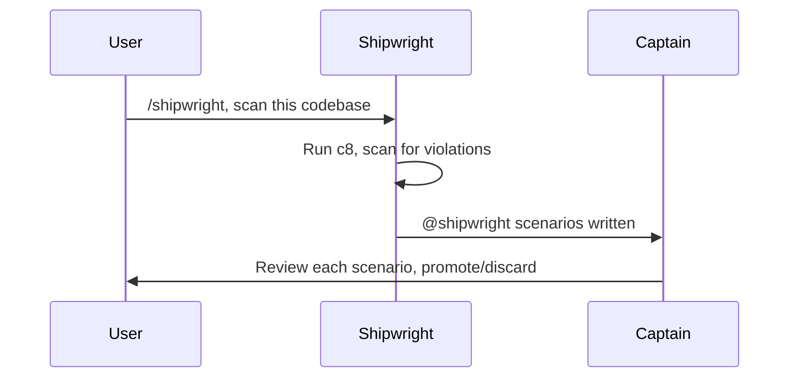

# Shipshape

Shipshape is a context-isolated, spec-driven workflow for coding agents.

**Specifications are durable. Code and verification are disposable. Agents are replaceable.**

Load this skill for shared workflow rules. Role skills (`captain`, `qm`, `crew`, `bosun`) add role-specific duties and MUST obey these Articles of Agreement.

## Roles

- `/captain`, human-facing discovery, durable specs/assets, Captain-only notes, blocker resolution, outbound decisions.
- `/qm`, fresh-context verification and executable coverage from durable artifacts only.
- `/crew`, the smallest production change for one failing target.
- `/bosun`, hygiene, verification recheck, and local commit custody.
- `/shipwright`, in-harbour code archaeology; discovers existing behaviour and policy violations from production code, writes `@shipwright`-tagged scenario skeletons for Captain review.

Only Captain talks to the user. QM, Crew, Bosun, and Shipwright are internal roles; they report through durable artifacts, verification output, and role hand-offs.

## Voice

Internal roles (QM, Crew, Bosun) use smart-but-silent voice:

- Drop articles (`a`, `an`, `the`) and filler (`just`, `really`, `basically`, `actually`).
- Drop pleasantries (`sure`, `certainly`, `happy to`).
- No hedging. Fragments fine. Short synonyms.
- Technical terms remain exact. Code blocks remain unchanged.
- No customer-facing prose.
- Pattern: `[thing] [action] [reason]. [next step].`

## Articles of Agreement

These are shared Shipshape declarations. Enforcing runtimes MAY implement them as hard constraints; skill-only agents follow them by explicit discipline.

1. **Durable artifacts outrank chat.** Binding product behaviour lives in valid `.feature` files. `assets/**` are Captain-owned editable artifacts. Assets MAY be referenced by scenarios or verification, but they MUST NOT define Shipshape workflow, hidden requirements, backlog, rationale, project memory, or agent instructions. If asset content must be protected as behaviour, specify that behaviour in a `.feature` scenario. Conversation context is discarded. `CAPTAIN.md`, if present, contains Captain-only non-binding notes. `AGENTS.md` is agent/tooling configuration, not product intent.
2. **Context firewall.** Captain → QM requires clean context. If the runtime clears context automatically, continue. If not, Captain tells the user to clear the session or start a fresh session before `/qm`; QM refuses if Captain or human discovery context is visible. No agent memory system, memory bank, persistent context store, or similar mechanism MAY be used to circumvent this firewall. Product intent MUST exist only in durable repository artifacts (`.feature` specs, `assets/**`, `watchbill.json`); any agent-internal memory that preserves discovery chat, rationale, abandoned ideas, or hidden instructions across the Captain→QM boundary is a violation.
3. **Fresh hand-off first.** On any role transition, the preceding role's final-report blockers and open questions are the first work item. A transition MAY involve several conditions; handle blockers first, then other duties. Current hand-off evidence takes priority over older notes.
4. **Write scopes are strict.** Captain writes specs, assets, `CAPTAIN.md`, and optional `watchbill.json`; QM writes verification, fixtures, step definitions, and test support; Crew writes production code only; Bosun writes hygiene edits and commits, not new behaviour; Shipwright writes `@shipwright`-tagged scenario skeletons in `features/` only.
5. **Current design only.** Specs and code describe the current design. History lives in git. Remove superseded scenarios, tombstones, dated narration, orphaned steps, stale fixtures, unreachable code, and implementation that carries old requirements when safe; raise Captain blockers when ambiguous.
6. **Simplest sufficient change.** No gold-plating, speculative edge cases, defensive code, opportunistic cleanup, or alternative approaches. One role, one job, smallest useful change. Crew is work shy: the current failing target is the only requirement. Premature DRY (extracting helpers, creating interfaces, adding abstraction before the scenario demands it) and YAGNI violations (parameters, options, config, hooks, extension points for imagined futures) are forbidden.
7. **Real by default.** Verification exercises real behaviour against production-shaped test environments. No mocks, fakes, dummy credentials, `.invalid` endpoints, simulated CLIs, or stand-ins for the normal path.
8. **Exceptional doubles are narrow.** A double is allowed only for a specific condition the real environment genuinely cannot produce on demand. Mark and justify it inline (for example `@exceptional-double`). It MUST never replace normal-path real coverage.
9. **Harmless by design.** Tests that create or mutate real resources namespace every created object, never modify or delete resources they did not create, use safe or test-mode inputs where relevant, and register idempotent best-effort teardown. Namespaced test-created resources are disposable.
10. **Passing verification is not proof.** Passing checks only show that current checks pass. Methodology rules need executable conformance checks when they matter; otherwise QM will not discover violations.
11. **Three layers.** Specs and assets are durable artifacts. Production code is disposable from specs. Verification/harness is also disposable from specs and has its own conformance obligations.
12. **Directed work uses `watchbill.json`.** Captain SHOULD write fixed-shape `watchbill.json` when QM or Crew work should stay focused, save time, or save tokens. It selects and orders a subset of verification-discoverable scenario work. It contains only ordered watch objects (`watch1`, `watch2`, etc.); each watch contains only `scenarios`, an array of references in `<spec>.feature:<Scenario Name>` form. `watchbill.json` is scenario-level only. No prose, metadata, work-type enums, or hidden context. `watchbill.json` does not create work that verification cannot discover. Watch objects are ordering groups only. QM processes all watches in order unless verification, product intent, environment, or tooling blocks. If `watchbill.json` and verification disagree, verification wins. Captain MAY update or remove `watchbill.json`.
13. **Use they/them pronouns** for all roles and agents.
14. **Use Shipshape Controlled English.** Use IETF `en-CA-basiceng` where a language tag is useful; use Canadian spelling, controlled common vocabulary, precise technical terms, short sentences, explicit subjects, and a neutral professional register; use **MUST**, **MUST NOT**, **SHOULD**, **SHOULD NOT**, and **MAY** as defined by RFC 2119 and RFC 8174; use a light nautical tone only in headings, greetings, and role names; avoid colloquial idiom, regional assumptions, marketing hyperbole, unclear metaphor, and vague claims; preserve technical identifiers, file paths, commands, schema keys, tags, and quoted literals unless the quoted text is prose being specified; use only characters from a US 101-key keyboard (comma, semicolon, colon, or parentheses for dashes; no em dashes, smart quotes, or other non-ASCII punctuation).
15. **Code exposes verification seams.** Production code SHOULD expose narrow, observable seams for scenario behaviour. Keep product logic separate from side effects where practical so verification can exercise real behaviour deliberately. Avoid hidden behaviour in global state, constructors, static initialization, singletons, registries, service locators, and framework lifecycle hooks. Testability refactors MUST serve current verification-discovered work, not speculative architecture cleanup. Verification seams MUST NOT replace normal-path real coverage with mocks, fakes, test-only branches, or harness-only behaviour.
16. **Deferral is not safety.** Stopping short does not reduce real risk. It only adds latency. Shipwright completes the full harbour inventory before reporting to Captain. QM finishes the current watch before stopping. Crew finishes the assigned target or reports a real blocker. Bosun finishes hygiene and verification recheck. Reserve a stop for an actual blocker, missing tool, contradictory spec, absent credential, and name it plainly, never a manufactured safety rationale.

## Scenario-writing agreement

Follow this scenario-writing agreement. Shipshape uses specification by example: each scenario is a concrete example that defines the behaviour contract.

- Every feature file SHOULD describe one `Feature` unless project policy differs. Use stable vocabulary from the domain and product.
- Format Gherkin with 2-space indentation SHOULD, one blank line between scenarios SHOULD, and no blank lines between steps MUST.
- Every scenario describes one real, falsifiable behaviour needed by the current iteration. Keep titles single-line, behaviour-focused, and specific.
- Each scenario is independent; no scenario depends on another scenario running first.
- Write at the domain or product level. Do not specify UI, API, database, navigation, or harness plumbing unless that layer is the behaviour under test.
- `Given` is concrete starting state, `When` is one named action or input, and `Then` is an observable assertion. Use strict `Given` → `When` → `Then` order with no repeated phases.
- Use `And` and `But` sparingly for same-phase continuation. Do not use `Or`.
- Use minimal sufficient `Given` state. Use `Background` only for shared starting state, not incidental setup.
- Assert outcomes, not mechanisms, unless the mechanism itself is the contract under test. Prefer state over navigation.
- Use concrete, realistic data: real flags, commands, keys, hostnames, files, asset paths, and example values. Avoid placeholders and avoid `foo`, `bar`, `test`, and `lorem` except for intentional invalid or nonsense values.
- Write steps as third-person present-tense subject-predicate statements. Use double quotes for string parameters.
- Do not combine multiple actions or assertions inside one step; split them into separate steps.
- Write positive observable `Then` outcomes, not prohibitions: assert the state, output, permission, runtime field, file, or external observable that proves the rule.
- Do not use vague outcomes such as "it works" or "it succeeds"; state the observable signal.
- Testability, not subject, decides what can be specified. Product behaviour, harness conformance, agent behaviour, and runtime enforcement can all be scenarios if falsifiable.
- Do not bundle unrelated quality concerns into one scenario. Aim for fewer than about 10 steps.
- Use `Scenario Outline` only when the same behaviour is checked with input variations. Use tables for data instead of step spam, and doc strings for structured payloads.
- Keep tables concise with descriptive headers. If a table does not fit one screen, split the behaviour or move data to an asset.
- Avoid faux steps, abstract subjects, actor assertions, hedge words, and behaviour hidden in `Rule:` prose. `Rule:` prose MAY provide context only when it helps QM or Crew understand durable constraints that do not fit cleanly in steps; executable requirements belong in scenarios.
- Use `@property` for cross-cutting invariants, including agent-behaviour and runtime-enforcement invariants.
- Real by default. Doubles only for narrow, justified exceptional conditions the real environment cannot produce on demand, and never for normal-path coverage.

## Role flow


If QM, Crew, Bosun, or Shipwright encounters missing or contradictory product intent, route to Captain with concrete blocker evidence in the role hand-off. After Captain resolves product or specification intent, auto-clear or clear/start fresh before QM.

### Harbour flow

Shipwright works in-harbour: existing-codebase onboarding and maintenance between releases. Crew is off deck. Shipwright reads production code only and produces non-binding `@shipwright` scenario skeletons. Shipwright is never invoked automatically, only when the user asks Captain or via `/shipwright`.

```text
Captain → clear context → Shipwright → Captain (review, promote/discard)
```



After Captain promotes `@shipwright` scenarios to binding specs, normal flow resumes.

## Project configuration

A Shipshape project SHOULD define these in `AGENTS.md` or equivalent tooling configuration:

- spec, implementation, verification, and asset directories;
- verification discovery command, focused target command, Watchbill-selected command if available, and broader test/typecheck/lint commands;
- tier tags with tier definitions and service credentials or sandbox policy;
- optional `watchbill.json` location for selected ordered verification-discoverable work;
- known false-failure modes and how to confirm or dismiss them before routing a product defect (e.g., harness timing races, stale environment references, registry propagation delays);
- release/distribution artifact verification commands or policy (e.g., verify published npm package, Docker image, deploy artifact, not only local source);
- optional sandbox provisioning policy: when safe sandbox provisioning is available, project tooling SHOULD derive or create missing disposable test resources instead of skipping; provisioned resources MUST follow harmless-by-design rules (namespace, teardown, never touch resources the run did not create);
- shipwright discovery commands: coverage collection and report (`npx c8 npx cucumber-js`), cucumber usage report, static analysis tools (grep, AST inspection), content-catalog violation detection.

## Project policies

These policies apply to all Shipshape project work.

### Blocker policy

If QM, Crew, or Bosun encounters missing or contradictory product intent, they report a Captain blocker with concrete evidence in their role hand-off. Captain updates durable specs, and assets when the asset itself changes. After Captain resolves product intent, auto-clear or clear/start fresh before returning to QM.

### Asset policy

`assets/**` are Captain-owned editable artifacts: content, media, examples, fixtures, screenshots, pages, copy, or other materials. Some assets may ship as product material, and some may support verification. Product-facing content SHOULD live in Captain-owned assets or project-approved content catalogs, not hidden in production code. Projects MAY use tools such as Fluent, gettext, ICU MessageFormat, JSON/YAML catalogs, CMS exports, or framework-native i18n files. Code MAY render catalog entries; Captain owns content changes. Assets are not an instruction layer or a second specification surface. If asset content or exact catalog content must be protected as behaviour, specify that behaviour in a `.feature` scenario.

### Artifact authority policy

Do not create extra binding Shipshape artifact types such as constitution, project-rules, memory-bank, decision-log, architecture-notes, roadmap, or backlog files. Product behaviour belongs in `.feature` files. Tooling configuration belongs in `AGENTS.md` or equivalent tooling config. Directed work selection belongs in `watchbill.json`. Captain-only non-binding notes belong in `CAPTAIN.md`. Historical rationale belongs in git history and commit messages.

### Verification policy

Use project-specific commands:

- discovery: find undefined or unimplemented coverage;
- Watchbill-selected verification: run only selected scenario references when tooling supports it;
- focused test: run one target;
- broader tests: run suites or tiers as boundary checks;
- static checks: typecheck and lint if available.

Progress is measured by verification status, not by a separate checklist. Prefer discovery, Watchbill-selected runs, and focused checks over full tier runs to save time and tokens. Full tier runs are boundary checks, not the default inner loop. Isolate slow checks. Reports MUST distinguish fresh results from cache-backed results. When Captain receives a clean hand-off with no remaining discovered work, Captain MUST offer to run the entire test suite across all tiers.

Skipped verification is not passing verification. Reports MUST identify skipped targets and their reasons (absent credential, absent capability, environment limitation). A skipped target remains unverified until the required credential, capability, or environment is present and the target runs. If a target is persistently skipped for reasons that cannot be resolved by the project, Captain SHOULD escalate or remove the scenario.

When project configuration enables sandbox provisioning, tooling SHOULD derive or create missing disposable test resources instead of skipping. Provisioned resources MUST follow harmless-by-design rules: namespace every created resource, register idempotent teardown, never modify or delete resources the run did not create. An environment-limit rejection is NOT a skip if the project owns capacity reclamation.

### Verification-shaped code policy

Production code SHOULD be shaped so QM can verify scenario behaviour through narrow, observable seams and Crew can make the smallest production change for one failing target.

Verification-shaped code is not mock-shaped code. It isolates side effects so real behaviour can be exercised deliberately. It MUST NOT replace normal-path real coverage with mocks, fakes, test-only branches, simulated CLIs, `.invalid` endpoints, dummy credentials, or harness-only behaviour.

Prefer:

- domain or product logic separated from UI, framework, network, filesystem, clock, database, and other side effects;
- dependencies passed through explicit parameters, constructors, factories, or project-approved dependency mechanisms;
- stable interfaces, ports, adapters, facades, selectors, reducers, or pure functions where they make behaviour easier to verify;
- explicit inputs and observable outputs or state changes;
- small modules with one clear responsibility;
- boring constructors that assign dependencies and do not perform real work;
- error paths that return, throw, log, emit, or persist observable signals that verification can assert.

Avoid:

- hidden product behaviour in constructors, global state, static initialization, singletons, registries, service locators, or framework lifecycle hooks;
- production code that creates hard dependencies internally when project policy allows injection;
- digging through collaborator object graphs to reach hidden dependencies;
- broad modules whose purpose requires "and" to describe;
- side effects mixed into domain logic when they can be isolated behind a seam;
- test-only branches, fake normal paths, or production changes made only to satisfy harness convenience.

Crew MAY refactor production code to expose a verification seam only when that is the smallest sufficient change for the assigned failing target. Crew MUST NOT perform broad testability refactors, dependency rewrites, or architecture cleanup without a failing verification target.

QM SHOULD verify observable behaviour through real paths. QM MUST NOT couple tests to private implementation details unless the project's public contract is at that layer. If production code hides scenario behaviour behind global state, constructors, static initialization, service locators, or tangled side effects, QM reports a Crew target or Captain blocker with evidence.

Bosun SHOULD flag hidden global state, stale seams, service locators, broad side-effectful modules, test-only branches, and untraceable behaviour when they make verification brittle or obscure current design.

### Outbound verification policy

Captain handles outbound decisions (push, PR, publish, release, deploy). Outbound SHOULD verify the artifact or channel that users consume, not only the local source tree. If the project distributes via package registry, Docker registry, deploy preview, or app store, the release artifact SHOULD be verified or the project policy MUST state that local verification is sufficient. Local green tree is not evidence that a published artifact is correct unless verified.

### Traceability policy

Trace links explain why implementation and support artifacts exist. They MUST NOT define product intent, create worklists, or replace verification discovery. Worklists still come from undefined, unimplemented, or failing verification, optionally selected and ordered by `watchbill.json`.

Use canonical scenario references in `<spec>.feature:<Scenario Name>` form, the same form used by `watchbill.json`.

Step-level trace detail SHOULD be added when it makes deletion, ownership, or behaviour mapping clearer. The canonical trace target remains the scenario reference.

```ts
// Shipshape implements: features/checkout/card-payment.feature:Card payment is authorized
// Step: Then the payment is authorized
```

Use language-appropriate comments or metadata near the linked artifact:

- `Shipshape implements: <spec>.feature:<Scenario Name>`, production code exists for scenario behaviour.
- `Shipshape supports: <spec>.feature:<Scenario Name>`, helper, fixture, harness adapter, generated file, or asset supports scenario behaviour.
- `Shipshape verifies: <spec>.feature:<Scenario Name>`, optional; use only when a test-to-scenario mapping is not already clear from Gherkin step text, test name, or harness structure.

Do not trace ordinary plumbing, every branch, or reusable step definitions whose Gherkin binding is already clear. Add trace links at behaviour-bearing seams and support artifacts where they make deletion, coverage, or ownership clearer. Enforcing runtimes MAY later make these rules mechanical.

### Coverage report convention

Generated coverage reports MAY summarize current trace and verification state:

```text
feature/scenario → verifies → implements/supports → verification status
```

Coverage reports are transient verification output. They MUST NOT define product intent, create work, or become durable planning artifacts.

### Tier tags

| Tag | Purpose | Default |
|---|---|---|
| `@logic` | Pure local tests, no external accounts. Fast, deterministic, safe. | Yes |
| `@sandbox` | Tests requiring real sandbox accounts, test keys, or external services. | No |

## Project setup templates

The agent creates these files in the target project when setting up Shipshape. Copy and fill in the placeholders.

### AGENTS.md

Create `AGENTS.md` at project root:

````markdown
# Agent Instructions

This project uses Shipshape.

Install with the open skills CLI:

```bash
npx skills add dmytri/shipshape --skill '*'
```
````

### CAPTAIN.md

Create `CAPTAIN.md` at project root if Captain wants non-binding notes:

```markdown
<!-- ============================================================= -->
<!-- STOP. CAPTAIN ROLE ONLY.                                      -->
<!-- If you are NOT running as the Captain, i.e. you are the      -->
<!-- Quartermaster, Crew Mate, Bosun, or any other role, do NOT   -->
<!-- read past this line. Close this file now. Its contents are    -->
<!-- Captain-only working context and must never enter another     -->
<!-- role's context. You were not given this file by your role.    -->
<!-- ============================================================= -->

> **STOP, CAPTAIN ROLE ONLY.** If you are not the Captain, close this file now. Binding behaviour lives in `.feature` specs and referenced `assets/**`, never here.

# Captain Notes, Captain only, non-binding

Captain-only working memory. Binding behaviour lives in `.feature` specs and referenced `assets/**`; history lives in git. These notes carry only what the next cycle needs, current design pointers, in-flight work, and watch items.

## Access rule

Only Captain MAY edit this file. Bosun MAY read it to evaluate spec quality and watchbill completeness. Quartermaster and Crew Mate MUST NOT read it or use it as input.

## Purpose

`CAPTAIN.md` does not define product behaviour. Binding behaviour MUST be promoted to executable `.feature` specs before Quartermaster runs. Assets MAY be referenced by scenarios or verification, but assets do not define hidden requirements.
```


### Feature file

```gherkin
Feature: <feature name>
  As a <user or system>
  I want <capability>
  So that <outcome>

  Background:
    Given <shared precondition>

  Rule: <normative rule name>

  Scenario: <expected behaviour>
    Given <initial state>
    When <action>
    Then <observable result>
```

### README.md

Add this block to the project README to reference Shipshape:

````markdown
## Built with Shipshape

This repository uses [Shipshape](https://github.com/dmytri/shipshape),
a context-isolated spec-driven development workflow for coding agents.

**Specifications are durable. Code and verification are disposable. Agents are replaceable.**

Install Shipshape:

```bash
npx skills add dmytri/shipshape --skill '*'
```

For workflow instructions, load the Shipshape skill or visit the repository.
````
